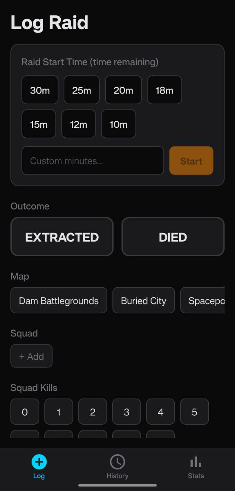
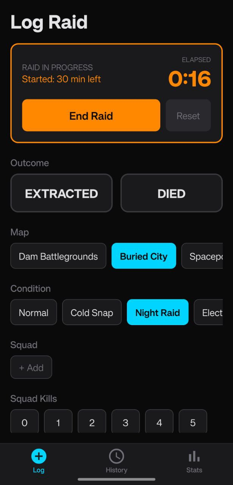
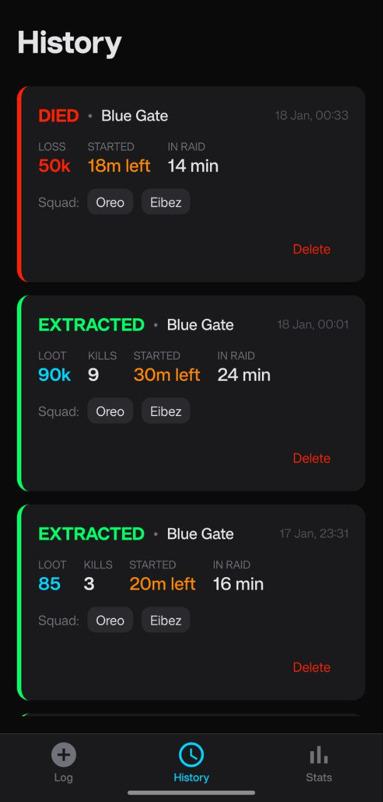
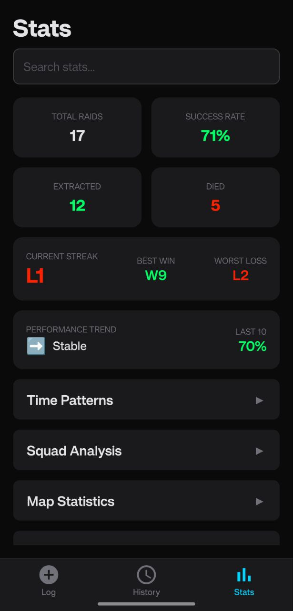
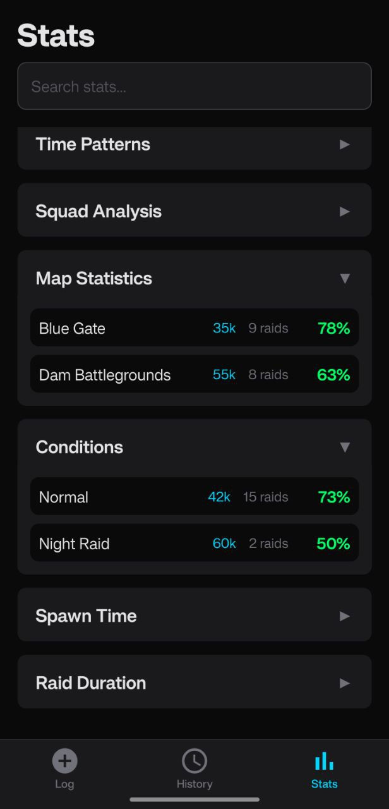

# Arc Stats Tracker

A mobile app for tracking your Arc Raiders raids. Log your raids, analyze your performance, and find out what works best.

## Screenshots

### Log Your Raids

Quickly log raid outcomes between matches with an intuitive interface.

<p align="center">
  
  
</p>

### Track Your History

View all your past raids with detailed information.

<p align="center">
  
</p>

### Analyze Your Stats

Get insights on your performance with comprehensive statistics.

<p align="center">
  
  
  
</p>

## Features

- **Quick Raid Logging** - Log success/failure, teammates, loot value, and more
- **Interactive Timer** - Start a timer when you enter a raid, auto-calculate duration
- **Map & Conditions** - Track which maps and weather conditions work best for you
- **Squad Analysis** - See your success rate with different teammates and squad sizes
- **Time Patterns** - Discover your best days and times to play
- **Streak Tracking** - Monitor your win/loss streaks
- **Loot Analysis** - Track your earnings and efficiency

## Installation

### Android

Download the latest APK from the [Releases](../../releases) page.

### Development

1. Install dependencies
   ```bash
   npm install
   ```

2. Start the app
   ```bash
   npx expo start
   ```

## Tech Stack

- React Native / Expo
- Tamagui (UI Framework)
- AsyncStorage (Local Data)
- EAS Build (Distribution)